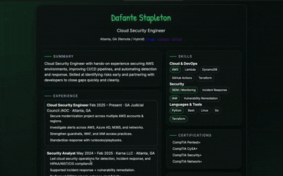

# Cloud-Resume
# 🧠 Cloud Resume Challenge — Dafante Stapleton

This is my implementation of the Cloud Resume Challenge using AWS.  
The goal: build a secure, cloud-hosted, serverless resume application and automate deployment.

---

## 🔗 Live Project

👉 https://dafantestapletonresume.link

---

## 🏗️ Architecture

- **S3** — Static site hosting  
- **CloudFront** — CDN + HTTPS enforcement  
- **Route 53** — Custom DNS domain  
- **API Gateway** — API endpoint for visitor counter  
- **AWS Lambda (Python)** — Backend logic for counter  
- **DynamoDB** — Stores unique visitor count  
- **AWS SAM** — Infrastructure as Code  
- **GitHub Actions** *(coming)* — Automated deployment + cache invalidation  

---

## 📊 Visitor Counter

Tracks unique visitors using:
- LocalStorage to prevent duplicate counting
- Lambda function updates DynamoDB table
- Count returned to frontend via API

---

## 🔐 Security Highlights

- HTTPS required everywhere through CloudFront
- IAM least-privilege role for Lambda
- Backend code serverless — no servers exposed

---

## 🚀 Next Steps

- Add CI/CD with GitHub Actions
- Add screenshots of desktop + mobile views
- Publish blog write-up on lessons learned

---
🔗 LinkedIn: https://www.linkedin.com/in/dafantestapleton
